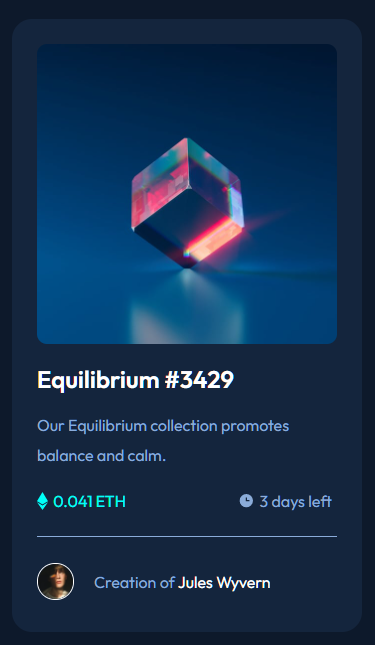

# Frontend Mentor - NFT preview card component solution

This is a solution to the [NFT preview card component challenge on Frontend Mentor](https://www.frontendmentor.io/challenges/nft-preview-card-component-SbdUL_w0U). Frontend Mentor challenges help you improve your coding skills by building realistic projects. 

## Table of contents

- [Overview](#overview)
  - [The challenge](#the-challenge)
  - [Screenshot](#screenshot)
  - [Links](#links)
- [My process](#my-process)
  - [Built with](#built-with)
  - [What I learned](#what-i-learned)
  - [Continued development](#continued-development)
  - [Useful resources](#useful-resources)
- [Author](#author)

## Overview

### The challenge

Users should be able to:

- View the optimal layout depending on their device's screen size
- See hover states for interactive elements

### Screenshot



### Links

- Solution URL: [Solution here](https://github.com/JustANipple/nft-preview-card-component/blob/master/styles.css)
- Live Site URL: [live site](https://justanipple.github.io/product-preview-card-component-master/)

## My process

### Built with

- Semantic HTML5 markup
- CSS custom properties
- Flexbox
- CSS Grid
- Link attributes
- Responsive design

### What I learned

I can place a link over a background image and make it appear just when i hover the mouse pointer on the block.

```css
.imgLink svg {
    visibility: hidden;
}

.imgLink:hover svg {
    visibility: visible;
}
```

### Continued development

For further development, i'll try to implement a better way to organize HTML and CSS to make more clear what every group of rules make
I still need to figure out how to make spacing between different elements and blocks the same, so it feels more organized

### Useful resources

- [Visibility attribute for links](https://developer.mozilla.org/en-US/docs/Web/CSS/visibility) - This helped me to show the cyan and eye elements on the image just when hovering with the mouse pointer

## Author

- Frontend Mentor - [@JustANipple](https://www.frontendmentor.io/profile/JustANipple)